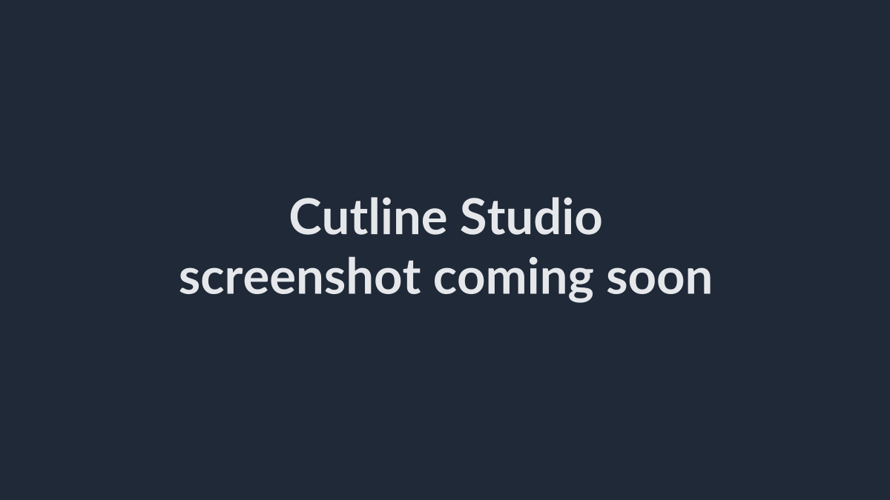

# Cutline Studio

Cutline Studio is a Windows desktop MVP for combining multiple source videos into one final video. Version 1.18 ships a redesigned docked dark workspace (single orange accent, hairline panel dividers) with:

- Slim toolbar with project open/save, undo/redo, and a top-right Export button
- Tabbed left panel: media bin and subtitle tools (import / offline generate / export)
- Program monitor with millisecond scrubbing and split-at-playhead editing
- Multi-track timeline (video, subtitle, and audio tracks) with zoom and clip context menu
- Inspector for trim points, speed, fades, and volume per clip
- Status bar with timeline/proxy status and live hints
- Bilingual UI (中文 / English) switchable at runtime
- MP4 export with FFmpeg, GPU-preferred rendering, CUDA-assisted scaling when available, and bitrate presets
- Output aspect presets including 16:9, 4:3, 2.35:1, 9:16, 3:4, 5.8-inch style, and 1:1

## 📸 Screenshots

<!-- Replace screenshots/screenshot.png with a real capture (keep the filename), or add more images below. -->


## Requirements

- Node.js installed

The app bundles FFmpeg binaries through npm packages, so you do not need a system `ffmpeg` install.

## Run

```bash
npm install
npm start
```

## Build EXE

```bash
npm run pack:win
```

The portable Windows executable is written to `dist/<version>/Cutline Studio-<version>-portable.exe`.

Each packaged version is kept in its own folder under `dist/<version>/`, so builds like
`Cutline Studio-1.0.1-portable.exe` and `Cutline Studio-1.0.2-portable.exe` can coexist.
The intermediate `win-unpacked` folder is removed automatically after packaging finishes.

## Features

- Import multiple clips (file picker or drag-and-drop)
- Automatically add newly imported clips to the sequence
- Double-click clips to add extra copies to the sequence
- Reorder clips in the sequence
- Trim each clip by milliseconds; adjust speed, fade in/out, and volume
- Split the selected sequence clip at the current playhead
- Scrub and play the full timeline across clip boundaries in the program monitor
- Subtitle track: import `.srt` / `.vtt`, edit cues, drag cue position on the preview, export `.srt`
- Generate subtitles fully offline with a bundled faster-whisper engine (CUDA or CPU)
- Save and open projects, with media re-link on load and a recent-projects menu
- Undo / redo for editing operations
- Export the whole sequence as one MP4 with auto GPU preference or software fallback
- Optional separate audio file export (M4A / MP3 / WAV)
- Pick output aspect ratios like 16:9, 4:3, 2.35:1, 9:16, 3:4, 5.8-inch, 1:1, or custom width/height
- Choose higher export bitrates and see estimated file size / render ETA during export
- Automatically generate silent audio for clips that do not contain audio
- Automatically generate compatible preview proxies for smoother playback

## Notes

- This is an MVP, not a full Adobe Premiere replacement.
- Export re-encodes clips to a consistent resolution and frame rate for reliable stitching.
- Timeline preview is proxy-assisted for smoother playback and better codec compatibility.
- The current packaged build is an unsigned portable `.exe` and uses Electron's default app icon.

## License

This project is licensed under the **GNU General Public License v3.0 (GPL-3.0)** — see the [LICENSE](LICENSE) file for the full text.

### Third-party software

Cutline Studio bundles **FFmpeg** via the [`ffmpeg-static`](https://www.npmjs.com/package/ffmpeg-static) package. The bundled FFmpeg build is distributed under the **GNU GPL**; because a GPL-licensed FFmpeg binary is redistributed with this application, the project as a whole is released under **GPL-3.0**. FFmpeg is © the FFmpeg developers — see the [FFmpeg legal page](https://ffmpeg.org/legal.html) for details.
